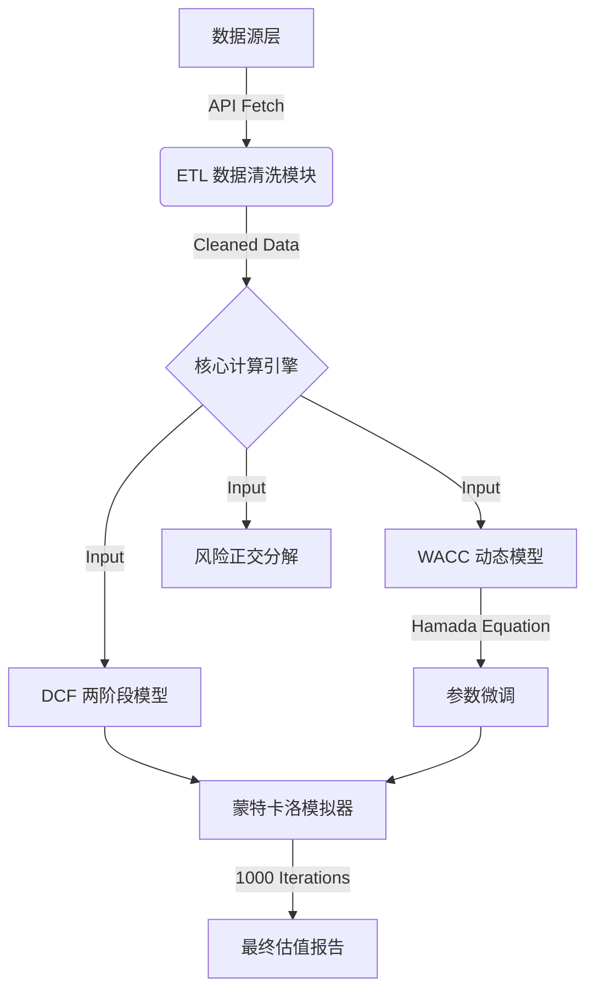

# 基本面量化蒙特卡洛双重 DCF 估值引擎与动态风险归因系统
### Fundamental Quantitative Monte Carlo Dual DCF Valuation Engine & Dynamic Risk Attribution System


## 项目概述 (Project Overview)

**基本面量化蒙特卡洛双重 DCF 估值引擎与动态风险归因系统**
*(Fundamental Quantitative Monte Carlo Dual DCF Valuation Engine & Dynamic Risk Attribution System)*

本项目是一个基于 Python 构建的机构级量化估值系统，旨在通过基本面逻辑 (Fundamental Logic) 与随机过程模拟 (Stochastic Process) 的深度融合，捕捉成熟期企业的定价偏差 (Pricing Inefficiency)。

本系统采用模块化函数设计 (Modular Design) 与向量化运算 (Vectorization)，将单股估值耗时压缩至毫秒级。系统集成了鲁棒的 ETL 数据管道、深度财务取证模块 (Financial Forensics) 以及蒙特卡洛动态模拟器，实现了从非结构化数据清洗到内在价值置信区间输出的全流程自动化，为投资决策提供严谨的 "Quantamental"（基本面+量化）支持。

#### 核心功能特性 (Core System Features)

* **量化工程与防御性数据治理 (Quantitative Engineering & Defensive Governance)**
    针对 Yahoo Finance 非结构化数据的特性，系统内嵌模糊字段匹配 (Fuzzy Matching) 与多重兜底策略。设计了高鲁棒性的数据熔断机制，对异常税率和 WACC 实施动态去极值 (Winsorization) 处理，并在时间序列对齐中严格剔除前视偏差 (Look-ahead Bias)，确保回测逻辑的严谨性与数据输入的稳定性。

* **深度财务取证与盈余质量分析 (Financial Forensics & Earnings Quality)**
    针对高现金流标的定制了两阶段 DCF 模型，内嵌盈余质量分析模块。系统能够自动监测 FCF 与净利润的 CAGR 历史背离度，识别潜在的应计利润异常 (Accruals Anomaly)，并支持对非经常性损益（如一次性罚款、资产减值）进行自动清洗与还原 (Normalization)，为模型增长率假设提供量化约束。

* **动态资本结构调整 (Dynamic Capital Structure Adjustment)**
    系统集成 Hamada Formula，自动执行 Beta 的去杠杆 (Unlevering) 与再杠杆 (Relevering) 运算。通过动态调整不同资本结构下的风险系数，系统能够剥离财务杠杆带来的噪音，精准还原资产端纯粹的业务风险 (Business Risk)。

* **随机模拟与风险正交分解 (Stochastic Simulation & Risk Decomposition)**
    系统引入蒙特卡洛模拟 (1,000+ Scenarios)，将 WACC 和永续增长率 ($g$) 构建为正态分布随机变量，输出目标价的概率分布与置信区间 (Confidence Interval)。基于 CAPM 框架实现风险正交分解，量化计算资产的系统性风险 (Systematic Risk) 与特质波动率 (Idiosyncratic Volatility)，辅助判断资产的配置属性。


## 模型适用性 (Model Suitability)

本模型并非万能，它对标的资产有明确的筛选逻辑：

* **最佳适用**：
    * **高自由现金流 (High FCF)**：具有强大的造血能力。
    * **业务模式成熟**：如消费必需品、信息服务业。
    * **典型标的**：TRI, MDLZ, KO, PG。
* **不适用**：
    * **初创/亏损企业**：现金流为负，DCF 模型失效。
    * **周期性极强行业**：如航运、大宗商品，WACC 和 Growth 波动过大导致模拟失真。

## 基本面量化案例分析与实证检验 (Quantamental Case Studies & Empirical Validation)

> **测试环境说明 (Test Environment)**
> * **测试时间**: 2026年1月26日 (Jan 26, 2026)
> * **数据源**: Yahoo Finance Real-time API
> * **数据口径**: 截止测试日，系统抓取的最新完整财报为 **FY2024 (2024 Fiscal Year)**，因 FY2025 年报尚未发布 (预计发布窗口：2026年2月中旬 / Mid-Feb 2026)。

本模型不仅依赖定量计算，更强调对定性风险 (Qualitative Risks) 的识别。以下是基于本系统对四个核心测试标的进行财务取证与压力测试的结论：

### 1. Thomson Reuters ($TRI) - 双寡头护城河与流动性紧缩
* **核心逻辑**：法律双寡头 (Westlaw) + AI 溢价。
    * **现状**：股价曾于 2025年7月 触及约 37x P/E 高点。随着市场回归理性，截至 2026年1月，估值已回落至 ~30x P/E。
* **深度财务取证 (Financial Forensics)**：
    * **会计失真真相**：模型检测到 **净利润 CAGR (-27%)** 与 **FCF CAGR (+10.7%)** 的极端背离。主要源于 **Refinitiv 交易** 带来的高基数效应：
        1.  LSEG/Refinitiv 资产出售：公司此前出售 Refinitiv 并在 2023/2024 年间密集减持 LSEG 股份，录得巨额一次性投资收益，导致历史基数虚高。
        2.  AI 投资期：EBITDA 利润率承压主要系 "higher investments" (CoCounsel AI 平台) 所致，属于主动承担的短期成本。
    * **结论**：剔除一次性干扰后，核心订阅业务 (Westlaw) 产生的自由现金流依然强劲。
* **估值压力测试 (Valuation Stress Test)**：
    * **参数设定**：设定长期增长率 **$g = 5.0\%$**。
        * 逻辑：剔除重组波动，锚定 5.0% 以体现 Westlaw 的垄断溢价与抗通胀能力。
    * **对比结果**：
        * 模型内在价值: **$128.00**
        * 当前股价 (2026.1): **$123.40**
    * **结论**：**合理低估**。当前价格略低于内在价值，具备安全边际，未出现明显的 AI 泡沫。
* **核心风险：流动性紧缩与私有化预期 (Liquidity Contraction & Privatization)**
    * **流动性挤压验证**：
        1.  **控股股东大额增持 ($1.8B)**：据 SEC/SEDAR 监管文件披露（及 GuruFocus 2025年11月14日数据），控股股东 Woodbridge Company 执行了单笔大额增持，持股比例推高至 70.5%。
            * [Evidence: Woodbridge Co Ltd Expands Stake](https://www.gurufocus.com/news/3210832/woodbridge-co-ltd-expands-stake-in-thomson-reuters-corp-with-significant-share-acquisition)
        2.  **公司持续回购 ($1.0B)**：公司于 2025年8月 启动新一轮 **$10亿美元** 股票回购计划 (NCIB)，进一步回收流动性。
            * [Evidence: Thomson Reuters Buyback Program](https://www.thomsonreuters.com/en/press-releases/2025/august/thomson-reuters-announces-1-billion-share-repurchase-program)
    * **潜在市场风险**：公众持股量急剧萎缩至不足 30%。这导致机构流动性折价，更引发 **退市私有化 (Take-Private)** 担忧——若家族决定低溢价私有化，小股东面临被动出局风险。
    
### 2. Coca-Cola ($KO) - 重大税务争议与完美定价
* **核心风险：税务争议与转让定价 (Tax Litigation & Transfer Pricing)**
    * **争议机制**：IRS (美国国税局) 援引 **Section 482** 条款，指控公司通过将利润转移至巴西、爱尔兰等低税率海外工厂来规避美国税收。
    * **风险量化与验证**：
        1.  **已发生影响 ($6.0B)**：据 Los Angeles Times 报道，公司于 2024年8月 支付了 **$60亿美元** 税务保证金，直接导致模型中当期 FCF 骤降。
            * [Evidence: Coca-Cola to pay $6 billion in IRS back taxes](https://www.latimes.com/business/story/2024-08-05/coca-cola-to-pay-6-billion-in-irs-back-taxes-case-while-appealing-judges-decision)
        2.  **潜在尾部风险 ($16.0B)**：据 Forbes 深度分析，若 IRS 在后续年份追溯适用此判例，公司面临的累积税务总敞口高达 **$160亿美元**。
            * [Evidence: Coca-Cola Could Face $16 Billion IRS Bill](https://www.forbesmiddleeast.com/industry/business/coca-cola-could-face-%2416-billion-irs-bill-after-its-tax-court-arguments-fall-flat)
* **深度财务取证：数据滞后性与起跑线陷阱 (Data Latency & Anchor Trap)**
    * **异常现象**：模型日志显示起跑线 FCF 仅为 **$4.77B** (正常应为 ~$10B+)，导致 CAGR 显示为 -27.40%。
    * **成因解析**：
        * **财报日历效应**：由于测试日 (2026.1.26) 处于财报空窗期，公司尚未发布 FY2025 年报。模型自动抓取的最新数据锁定在 **FY2024**。
        * **起跑线坍塌**：FY2024 的现金流恰好包含了上述 **$60亿一次性罚款支出**。
    * **估值后果**：DCF 模型若基于这个被砸坑的 FY2024 数据 ($4.77B) 进行外推，会导致估值雪崩 (见下方 Case I)。必须进行人工手动加回 (Case II)。
* **估值敏感性分析 (Valuation Sensitivity Analysis)**：
    * **Case I: Unadjusted Basis (Bear Case / 未调整口径)**
        * *设定*：直接使用财报抓取的受损现金流 (起跑线 FCF **$4.77B**)，模拟“税务惩罚常态化”的最坏情况。
        * *结果*：乐观估值仅为 **$27.33**。
        * *隐含风险*：若 IRS 持续追缴，当前股价面临 **-62%** 的剧烈下行空间。
    * **Case II: Normalized Basis (Bull Case / 归一化口径)**
        * *参数设定*：设定长期增长率 **$g = 5.5\%$ (乐观上限)**。
            * *逻辑*：即便假设公司完全胜诉、不受后续税务影响，且维持超预期的增长速度。
        * *资金起点*：基于手动加回 **$60亿** 后的正常化现金流 (起跑线 FCF **~$10.8B**)。
        * *结果*：乐观估值 **$73.35** (天花板)。
    * **终极结论**：**完美定价 (Priced for Perfection)**。
        * 当前股价 (**$72.88**) 已触及 Case II (最乐观假设) 的理论上限。这意味着市场定价忽略了 $160B 的潜在风险 (Case I)，缺乏安全边际 (Zero Margin of Safety)。

### 3. Mondelez ($MDLZ) - 成本挤压与财务背离
* **核心风险：可可超级周期与销量下滑 (Cocoa Supercycle & Volume Decline)**
    * **成本冲击**：可可价格处于结构性高位，严重挤压毛利率。
    * **负面反馈**：为了保利润激进涨价，导致销量暴跌 **-4.6%** (Volume Decline)，显示定价权面临天花板。
* **深度财务取证 (Financial Forensics)**：
    * **异常背离**：模型检测到 **FCF 复合增速 (11.9%)** 远超 **净利润增速 (2.3%)**。
    * **逻辑推演**：这种“倒挂”通常暗示公司通过削减资本开支 (Under-investment) 或营运资本调整来美化现金流，而非核心盈利能力的大幅提升，高增长不可持续。
* **估值压力测试 (Valuation Stress Test)**：
    * **参数设定**：设定长期增长率 **$g = 2.5\%$**。
        * 逻辑：不使用虚高的 11.9% FCF 增速。作为防御性测试，强制将长期增长率下调至 2.5%，以对标其真实的净利润增速 (2.3%) 和长期通胀水平。
    * **对比结果**：
        * 模型内在价值: **$55.89**
        * 当前股价: **$58.40**
    * **结论**：**合理定价**。当前股价已充分反映“低增长”预期。虽然价格公允，但面临大宗商品逆风，缺乏安全边际。

### 4. Procter & Gamble ($PG) - 吉列减值与停滞
* **核心矛盾：会计噪音，增长停滞 (Accounting Noise & Stagnation)**
    * **数据异常真相**：模型检测到数据高缺失率及 FCF CAGR 计算失效。这源于2023/2024 财年吉列 (Gillette) 业务的巨额非现金资产减值，导致净利润账面失真。
    * **增长现实**：剔除噪音后，公司过去 5 年的营收复合增速仅为 **1.67%**，显示出其主要依赖提价维持业绩，销量增长 (Volume) 已触及天花板。
* **估值压力测试 (Valuation Stress Test)**：
    * **参数设定**：设定长期增长率 $g = 2.0\%$。
        * *逻辑*：将预期严格锚定在历史营收增速 (1.67%) 和长期通胀水平附近。
    * **对比结果**：
        * **模型内在价值 (中枢)**: **$123.92**
        * **当前股价**: **$150.15**
    * **结论**：**防御性溢价 (Defensive Premium)**。
        * 在 2% 增长假设下，PG 的股价显著高于其内在价值 ($124)。市场目前给予的高估值主要源于其“类债券 (Bond Proxy)”的避险属性，而非业务本身的增长潜力。若市场风险偏好回升，此类防御性资产可能面临估值回调。


## 系统架构 (System Architecture)



## 核心模块与技术细节 (Core Modules)

本项目完全由 Python 实现，包含以下核心模块：

### 1. 自动化 ETL 管道 (Data Pipeline)
- **多维数据提取**：自动处理利润表、资产负债表及现金流量表三大报表。
- **智能清洗算法**：
  - 自动识别财报会计准则差异（GAAP vs Non-GAAP）。
  - 强制时间序列对齐（Time-Series Alignment），防止回测中的“未来函数”偏差。
  - 异常值熔断机制：针对 Tax Rate < 0% 或异常 CapEx 进行平滑处理。

### 2. 高级风险定价模型 (Advanced Risk Pricing)
- **WACC 动态计算引擎**：
  - **Hamada Equation 应用**：自动执行 Beta 的去杠杆（Unlevering）与再杠杆（Relevering），剔除资本结构扭曲，还原资产端纯粹的业务风险。
  - **风险分解**：计算 $R^2$、系统性风险（Systematic Risk）与特质性风险（Idiosyncratic Risk）占比。
  - **ERP 动态锚定**：基于 20 年历史数据计算真实市场风险溢价。

### 3. 随机过程与模拟 (Stochastic Simulation)
- 将传统的 DCF 点估计转化为概率分布。
- **随机游走 (Random Walk)**：
  - 对 **WACC** 和 **Growth Rate** 引入正态分布随机扰动：
  - $g_{random} \sim N(\mu_{growth}, \sigma_{growth}^2)$
  - $WACC_{random} \sim N(\mu_{wacc}, \sigma_{wacc}^2)$

- 输出置信区间：提供 10%（悲观）、50%（中性）、90%（乐观）分位数的估值结果。

### 4. 增长率风控 (Growth Sanity Check)
- **财务取证**：自动计算历史营收、净利润与 FCF 的 CAGR（复合年化增长率）。
- **逻辑校验**：当预测增长率显著偏离历史均值或行业常识时，系统自动触发警告。


## 关键数学模型 (Mathematical Logic)

### 1. 自由现金流 (Free Cash Flow)
$$FCF = EBIT \times (1 - Tax) + Depr - CapEx - \Delta WC$$

### 2. 年化波动率 (Annualized Volatility, $\sigma$)
模型基于日度收益率计算资产的总风险，并依据 "时间平方根法则" (Square Root of Time Rule) 进行年化处理（该法则隐含了股价服从几何布朗运动 GBM 的假设）：
$$\sigma_{annual} = \sigma_{daily} \times \sqrt{252}$$
其中 $\sigma_{daily}$ 为日收益率的标准差，252 代表年均交易日。该指标衡量资产价格偏离均值的剧烈程度。

### 3. 贝塔系数 (Beta, $\beta$)
衡量资产相对于市场基准（S&P 500）的 系统性风险 (Systematic Risk) 或 市场敏感度 (Market Sensitivity)。
$$\beta = \frac{Cov(r_i, r_m)}{Var(r_m)} = \rho_{i,m} \times \frac{\sigma_i}{\sigma_m}$$
* **$Cov(r_i, r_m)$**: 资产与市场的协方差 (衡量方向是否一致)。
* **$Var(r_m)$**: 市场的方差 (衡量市场的总波动)。

### 4. 风险指标 (Risk Metrics)
我们使用皮尔逊相关系数 ($R$) 来衡量资产与市场的联动性，并据此分解系统性与特质性风险：
$$R = \rho_{i,m} = \frac{Cov(r_i, r_m)}{\sigma_i \sigma_m}$$

**风险正交分解**
**拟合优度 ($R^2$) 与 特质波动率 ($\sigma_{idio}$)**：
$$R^2 = R \times R \quad (\text{系统性风险占比})$$
$$\sigma_{idio} = \sigma_{total} \times \sqrt{1 - R^2} \quad (\text{特质性风险})$$

### 5. 哈曼达公式 (Hamada Equation)
用于在不同资本结构间调整 Beta，剥离财务杠杆影响：
$$\beta_L = \beta_U \times [1 + (1 - T) \times \frac{D}{E}]$$

### 6. 股权成本 (Cost of Equity - CAPM)
我们使用资本资产定价模型计算股东要求的最低回报率：
$$Ke = R_f + \beta \times (R_m - R_f)$$
其中 $R_f$ 为无风险利率， $(R_m - R_f)$ 为市场风险溢价 (ERP)。

### 7. 债务成本 (Cost of Debt)
计算公司的有效借贷利率，并引入信用底线熔断机制：
$$K_d = \frac{\text{Interest Expense}}{\text{Total Debt}}$$
风控约束：若计算出的 $K_d < R_f$ ，则强制设定 $K_d = R_f$ （假设信用点差 $\ge 0$ ）。

### 8. 加权平均资本成本 (WACC)
作为现金流折现的核心贴现率：
$$WACC = \frac{E}{V} \times Ke + \frac{D}{V} \times K_d \times (1 - T)$$
其中 $E$ 为权益价值， $D$ 为债务价值， $T$ 为有效税率。

### 9. 终值计算-戈登增长模型(Gordon Growth Model)
$$TV = \frac{FCF_5 \times (1 + g)}{WACC - g}$$


## 局限性与算法边界 (Limitations & Mathematical Boundaries)

**Garbage In, Garbage Out (GIGO) 原则**：本模型高度依赖输入数据的质量。除了数据源污染外，核心算法在特定数学边界条件下会失效，使用者必须理解以下数学与逻辑陷阱：

### 1. 哈马达公式的“杠杆失真” (Leverage Distortion)
* **触发条件**：资不抵债 (Negative Equity) 或 极高杠杆。
* **数学失效**：
    * 当公司净资产 $E < 0$ 时，公式 $\beta_L = \beta_U [1 + (1 - T) \frac{D}{E}]$ 中的 $\frac{D}{E}$ 变为负数，导致计算出的 $\beta_L$ 反而小于 $\beta_U$。这在数学上成立，但在金融逻辑上是**严重谬误**（破产边缘的公司风险应无限大，而不是变小）。
* **系统行为**：本系统未对负净资产进行特殊处理，因此**严格不适用于资不抵债的公司**。

### 2. Beta 值的“统计钝化” (Statistical Passivation)
* **触发条件**：防御性低波动蓝筹股（如 KO, MDLZ）。
* **数学后果**：
    * 此类股票与大盘的相关性极低，导致 $\beta_{Raw} \to 0$（甚至 < 0.5）。
    * 进而导致 $Ke \approx R_f$，最终使得 $WACC$ 极低（如 4%~5%）。
    * 根据 $Price = \frac{FCF}{WACC - g}$，当分母 $WACC$ 无限逼近 $g$ 时，**估值趋于无穷大 (Singularity)**。
* **系统行为**：系统已内置 **WACC Floor (7.5%)** 熔断机制，强制拉高分母，防止估值泡沫。

### 3. 正态分布假设的局限 (Normality Assumption)
* **理论缺陷**：蒙特卡洛模拟假设 WACC 和 g 服从正态分布。然而，真实金融市场存在 **"肥尾效应" (Fat Tails)** 和 **"波动率聚集" (Volatility Clustering)**，极端风险发生的概率远高于正态分布的预测。本模型可能低估极端黑天鹅事件的影响。

### 4. 周期性陷阱 (Cyclical Trap)
* **逻辑失效**：DCF 模型假设永续增长 ($g$) 为常数。但航运、能源等强周期行业的特征是“均值回归”，高增长后往往伴随负增长。
* **结论**：**本模型严格不适用于强周期性行业 (Cyclical Industries)**。


## 安装与使用 (Installation & Usage)

### 1. 安装依赖 (Install Dependencies)
确保你的环境已安装 **Python 3.9+**，并执行以下命令安装必要库：
```bash
pip install yfinance pandas numpy
```

### 2. 核心参数配置 (Critical Configuration) 
**在运行之前，需手动修改 `main.py` 底部的配置区域。**

请使用编辑器打开 `main.py`，滚动至底部的 `if __name__ == "__main__":` 模块，找到带有 `⭐` 标记的参数进行修改：
```bash
# 在 main.py 底部找到以下区域进行修改
# 1. 设定标的与基准
TICKER = "KO"      # <--- 修改这里！填入股票代码 (例如: "AAPL", "0700.HK", "TSLA")
MARKET = "^GSPC"   # <--- 修改这里！市场基准 (默认标普500，无需改动)

# 2. 设定心理预期增长率
# 分析师介入点 (Analyst Override)
# 逻辑：历史数据仅供参考，你需要根据对行业的判断输入一个显性期增长率 (g)
manual_growth_input = 0.05  # <--- 修改这里！(例如: 0.05 代表 5% 增长率)
```

**参数说明：**
* **`TICKER`**: 目标资产代码。支持 Yahoo Finance 的所有格式（美股直接填代码，港股加 `.HK`，A股加 `.SS`）。
* **`manual_growth_input`**: **显性期（前5年）预测增长率**。
    * *这是一个主观参数*。模型会计算历史 CAGR 给参考，但最终由自己决定。
    * **建议**：对于成熟股（如 KO, MDLZ），建议保守设定在 `0.02` ~ `0.06` 之间。


## 免责声明 (Disclaimer)

> **Investment Risk Warning / 投资风险警示**
>
> 本项目提供的代码、模型及估值结果仅供**金融工程研究与学术交流**使用，**严禁用于实际投资决策依据**。

1.  **数据滞后性 (Data Latency)**：模型高度依赖 Yahoo Finance API，数据可能存在延迟、缺失或错误（尤其是 CapEx 和非经常性损益项）。
2.  **模型局限性 (Model Limitation)**：DCF 模型对输入参数（如 WACC, g）极度敏感，微小的参数变动可能导致估值结果的巨大差异（蝴蝶效应）。
3.  **非投资建议 (No Investment Advice)**：作者不对任何因使用本代码而导致的资金损失负责。市场有风险，投资需谨慎。

---

**License**
[MIT](https://choosealicense.com/licenses/mit/) © 2026 Husijia Wu


